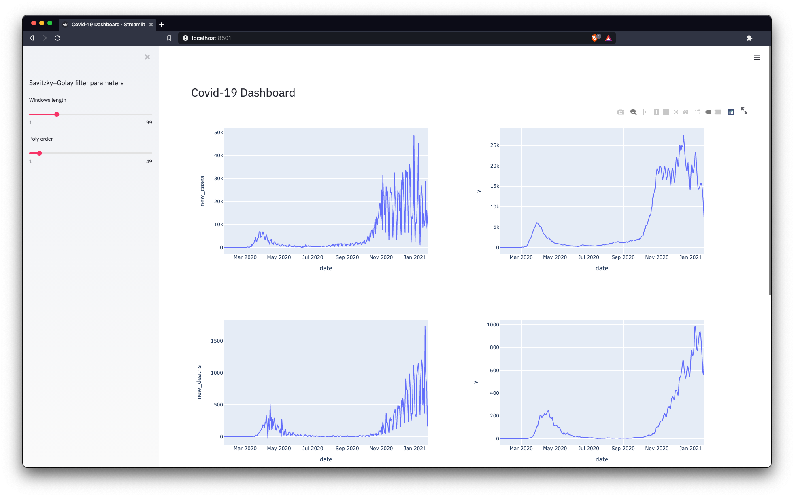

# Streamlit Covid19 Dashboard
**Hobby project! Not the work of an expert 😅**
### Sources
- [Source Dashboard](https://data.humdata.org/dataset/novel-coronavirus-2019-ncov-cases)
- [Global Cases Download ⬇](https://data.humdata.org/hxlproxy/api/data-preview.csv?url=https%3A%2F%2Fraw.githubusercontent.com%2FCSSEGISandData%2FCOVID-19%2Fmaster%2Fcsse_covid_19_data%2Fcsse_covid_19_time_series%2Ftime_series_covid19_confirmed_global.csv&filename=time_series_covid19_confirmed_global.csv)
- [Global Deaths Download ⬇](https://data.humdata.org/hxlproxy/api/data-preview.csv?url=https%3A%2F%2Fraw.githubusercontent.com%2FCSSEGISandData%2FCOVID-19%2Fmaster%2Fcsse_covid_19_data%2Fcsse_covid_19_time_series%2Ftime_series_covid19_deaths_global.csv&filename=time_series_covid19_deaths_global.csv)
- [Global Recovered Download ⬇](https://data.humdata.org/hxlproxy/api/data-preview.csv?url=https%3A%2F%2Fraw.githubusercontent.com%2FCSSEGISandData%2FCOVID-19%2Fmaster%2Fcsse_covid_19_data%2Fcsse_covid_19_time_series%2Ftime_series_covid19_recovered_global.csv&filename=time_series_covid19_recovered_global.csv)

### Setup
**Requirements**
```bash
pip3 install -r requirements.txt
```
**Download data**
```bash
python3 ./scripts/data_downloader.py
```
**Start streamlit server**
```bash
streamlit run ./streamlit_dashboard/app.py
```


